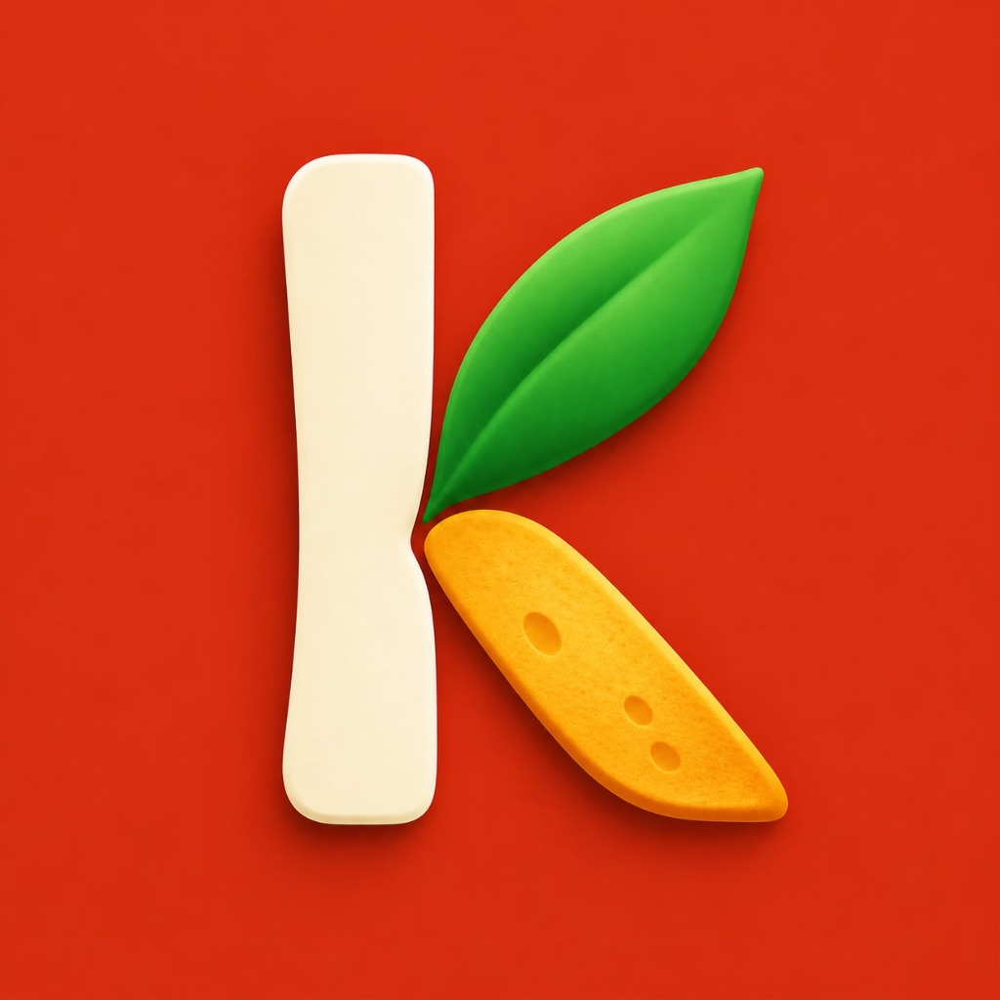

# 🥦 KALANLA — Smart Kitchen OS
### *Local-First Zero-Waste Smart Kitchen Assistant & Telemetry Engine*

<p align="center">
  
</p>

<p align="center">
  <a href="https://rynia.github.io/KALANLA/"></a>
  <a href="https://play.google.com/apps/testing/com.rynia.kalanla"></a>
  
  
  
  
  
</p>

---

## 🏛️ Vision & Philosophy

**KALANLA** is an autonomous, privacy-centric **Kitchen Operating System (Kitchen OS)** engineered to eliminate household food waste and protect domestic budgets.

Unlike conventional recipe apps that push users to grocery stores with *"go buy these ingredients"*, KALANLA operates in reverse: **"Start with whatever is left in your pantry."**

> *"Nobody downloads an app just for a pretty interface. An app becomes indispensable when it quietly saves food from rotting in the back of the fridge, leaving measurable cash in your pocket at the end of every month."*

---

## ✨ Key Features

### ⏱️ 1. 48-Hour Risk Radar (Shelf-Life Telemetry)
* Accurately calculates food expiration and spoilage windows down to the hour.
* **Urgent Consumption Badges:** Instant alerts such as *"Expires in 18h"*, *"Consume Today"* float deteriorating perishables to the top before they spoil.

### 🍳 2. Deterministic Zero-Waste Chef Engine
* Client-side deterministic recipe matching algorithm.
* **100% Offline-capable:** Generates proven rescue recipes (artisan crouton toasts, creamy leftover soups, skillet scrambles, broth bases) without relying on external API latency or internet connection.

### 🧾 3. 9:16 Thermal Savings Receipt (Financial Telemetry)
* Computes real-world financial currency savings and ecological carbon footprint reduction for every saved pantry item.
* Exports a nostalgic, retro thermal cashier receipt in native 9:16 story format for 1-tap sharing to Instagram Stories or messaging apps.

### ↩️ 4. Haptic Safety & Undo Guard
* Mistakenly marked an item as "Cooked" or "Discarded"? An automatic 5-second countdown with native haptic feedback shields you against accidental data loss.

### 🔒 5. 100% Local-First & Zero Tracking Architecture
* **No Account Required:** No emails, passwords, phone numbers, or social logins.
* **Zero Cloud Telemetry:** All pantry data, logs, and user preferences are encrypted and stored exclusively on-device (`AsyncStorage`). Your grocery habits belong to you.

---

## 🛠️ Tech Stack

| Layer | Technology | Description |
|:---|:---|:---|
| **Framework** | [React Native](https://reactnative.dev/) + [Expo](https://expo.dev/) (SDK 52) | Cross-platform (iOS & Android) native runtime |
| **Language** | [TypeScript](https://www.typescriptlang.org/) (Strict Mode) | Strong type safety with zero compile warnings (`tsc --noEmit`) |
| **Persistence** | `@react-native-async-storage/async-storage` | Fully on-device client hydration (Local-First) |
| **Icons** | `lucide-react-native` | Crisp, lightweight titanium vector icons |
| **Haptics** | `expo-haptics` | Precise tactile micro-interactions |
| **Canvas & Sharing** | `react-native-view-shot` + `expo-sharing` | High-fidelity 9:16 thermal receipt rasterizer and system share sheet |
| **DevOps & Pipeline**| EAS Build (Expo Application Services) | Automated Android App Bundle (.aab) & iOS IPA pipelines |

---

## 📂 Project Architecture

```bash
kiler-kitchen-os/
├── assets/                  # App icons, splash screens, and safe-zone adaptive assets
├── src/
│   ├── components/          # Modular UI widgets (Radar, Chef, Thermal Receipt, Modals)
│   ├── constants/           # Typography, color constants, copy definitions
│   ├── data/                # Food ontology, shelf-life rules, and fallback seeds
│   ├── services/            # Entitlements, store status, and telemetry engines
│   ├── storage/             # AsyncStorage schema validation, backup, and hydration
│   ├── theme/               # Dark Titanium palette (#0A0A0E) and responsive spacing
│   ├── types/               # TypeScript interfaces (PantryItem, Recipe, Subscription)
│   └── utils/               # Deterministic recipe matcher, time math, date formatters
├── app.json                 # Apple Privacy Manifest & Android permission configs
├── eas.json                 # Production build profiles for Google Play & TestFlight
└── App.tsx                  # Root state manager, navigation bar, and tab orchestration
```

---

## 🚀 Local Development Setup

To run KALANLA locally on your machine:

```bash
# 1. Clone the repository
git clone https://github.com/Rynia/KALANLA.git
cd KALANLA

# 2. Install dependencies
npm install

# 3. Verify TypeScript compilation
npx tsc --noEmit

# 4. Start Expo local development server
npx expo start
```

Press `a` for Android Emulator or scan the QR code with **Expo Go** / development build on your physical device.

---

## 🗺️ Product Roadmap

* [x] **v1.0.0 (Alpha / Closed Beta):** Pure Local-First core, 48h shelf-life risk radar, zero-waste recipe engine, retro thermal receipt generator.
* [ ] **v1.1.0:** 🧾💀 *Waste Autopsy Report*, 🎴 *Fridge Fortune*, On-device ML Kit receipt OCR parsing.
* [ ] **v1.2.0:** 🥘🔥 *Community Pot Pulse* (Anonymous concurrent cooker counters & audio bubbling reactions).
* [ ] **v1.3.0:** Family Pantry Sync (Multi-device local Wi-Fi / P2P sync).

---

## 📄 Privacy Policy & Compliance

* **Privacy Policy:** [https://rynia.github.io/KALANLA/privacy.html](https://rynia.github.io/KALANLA/privacy.html)
* **Website:** [https://rynia.github.io/KALANLA/](https://rynia.github.io/KALANLA/)
* **Developer & Studio:** [Rynia Studios](https://ryniastudios.netlify.app) (ryniastudios@gmail.com)

---

<p align="center">
  <b>Rynia Studios</b> © 2026 • <i>"Start with what's left."</i>
</p>
